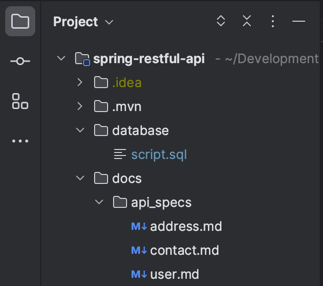
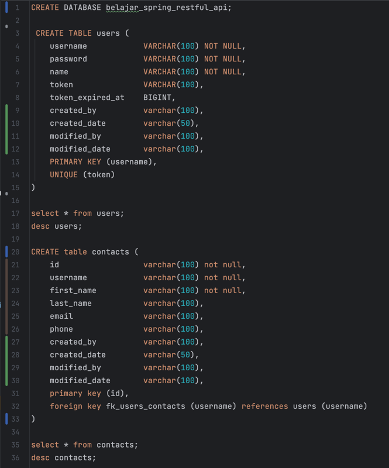
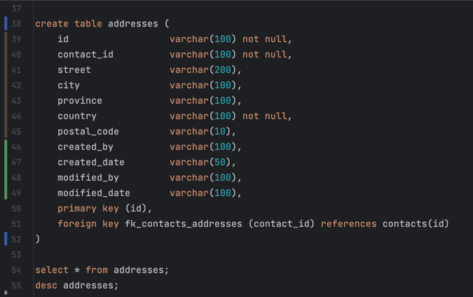
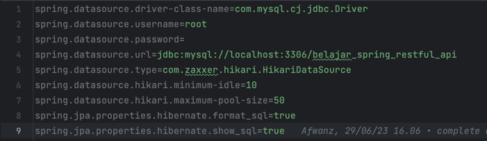
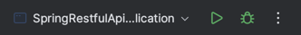

# spring-restful-api

## Local setup

Step 1: Download or clone the source code from GitHub to a local machine

Step 2: Prepare and setup MySQL database on local machine

Step 3: Create database, table, and column on local machine
> scipt create database etc available in source code:
1. > project: spring-restful-api 
2. > folder: database > script.sql

    

    

    

Step 4: Make sure your configuration is match based on application.properties in this project
> file: application.properties



Step 5: Run your project:
1. > if use IDE, run project with use main Class -> SpringRestfulApplication.java
i.e. IDE -> Intellij IDEA


2. > if run with terminal/ command line, type below :
- ```mvn clean install```
- ```mvn spring-boot:run```

## From the browser call the endpoint http://localhost:8080
